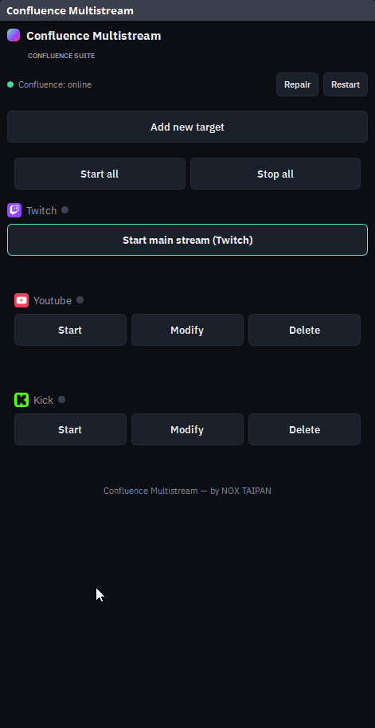
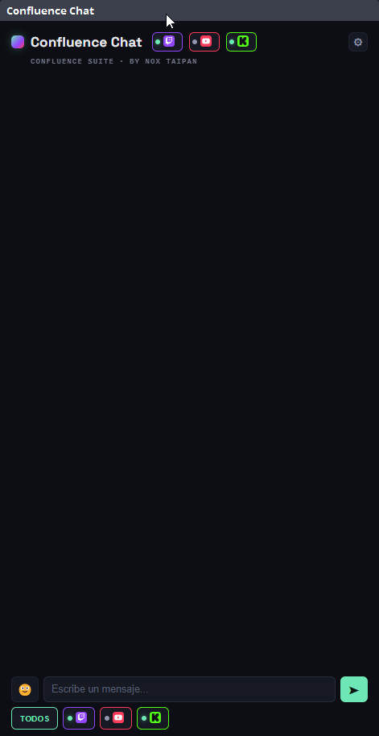

# Confluence (Beta)

**Confluence Suite** es un panel para streamers que unifica el control de Twitch, YouTube y Kick dentro de OBS, como Custom Browser Docks. Build pública de [NOX TAIPAN](https://github.com/NoxTaipan), pensada para que cualquier streamer la auto-hospede con sus propias credenciales OAuth: cada quien corre su propia instancia en su propia PC, no hay servidor compartido ni cuenta central — tus tokens y tu chat nunca salen de tu maquina.

La suite tiene tres piezas, cada una un dock/browser source independiente:

| Pieza | Que hace | Se agrega en OBS como |
|---|---|---|
| **Confluence Stream Info** | Publica titulo, tags y categoria a la vez en las 3 plataformas | Custom Browser Dock |
| **Confluence Chat** | Chat unificado de Twitch/YouTube/Kick, con composer para responder | Custom Browser Dock |
| **Confluence Overlay Chat** | El mismo chat pero en modo lectura, para mostrar en escena | Browser Source |

## Funciones

### Stream Info — titulo, tags y categoria en un solo lugar



- Conecta/desconecta cada plataforma con un click (OAuth, ventana popup que se cierra sola).
- Un titulo y una lista de tags compartidos para las 3 plataformas.
- Categoria/juego por plataforma: buscador con autocompletado para Twitch y Kick, dropdown para YouTube.
- **"Publicar a las 3"** de un solo click, o publicar a una plataforma sola.
- Guardar el formulario como borrador (persiste en el navegador) y recuperarlo la proxima vez, o limpiarlo todo.
- Log de resultados por plataforma (OK / error) despues de cada publicacion.

### Chat — las tres plataformas en un solo feed



- Feed en vivo unificado de Twitch, YouTube y Kick (Server-Sent Events, reconecta solo).
- Filtros por plataforma con punto de estado (conectado/desconectado) para mostrar u ocultar cada una.
- Resaltado de menciones: configura tu usuario y tus mensajes destacan en el feed.
- Emotes nativos de cada plataforma renderizados en linea (incluye 7TV en Twitch/Kick).
- Composer para responder: escribe una vez y envia a todas las plataformas conectadas o elegí una sola por mensaje, con selector de emojis.
- Limpiar el chat completo o solo el de una plataforma.

### Overlay Chat — el chat en tu escena
Pensado como **Browser Source** de OBS (no un dock) para mostrar el chat en pantalla mientras stremeas. Es de solo lectura y se configura por query string en la URL, sin necesidad de tocar código:

```
http://localhost:7773/overlay.html?limit=8&fade=20&platforms=twitch,kick&position=bottom-left
```

| Parametro | Que controla | Default |
|---|---|---|
| `limit` | Cantidad maxima de mensajes visibles a la vez | `8` |
| `fade` | Segundos hasta que un mensaje se desvanece solo (`0` = nunca) | `20` |
| `platforms` | Que plataformas mostrar, separadas por coma | `twitch,youtube,kick` |
| `position` | Esquina del feed: `bottom-left`, `bottom-right`, `top-left`, `top-right` | `bottom-left` |

## Instalacion

**Requisitos:** [Node.js](https://nodejs.org) (version LTS) y OBS Studio ya instalados.

### 1. Descargar el proyecto

```bash
git clone https://github.com/NoxTaipan/confluence-beta.git
cd confluence-beta
npm install
```

### 2. Crear tus apps OAuth

Confluence corre con **tus propias** credenciales — no hay ninguna app compartida ni servidor central. Vas a necesitar crear una app de desarrollador en cada plataforma que quieras usar (podes saltear las que no uses).

**Twitch**
1. Entra a [dev.twitch.tv/console](https://dev.twitch.tv/console) con tu cuenta de Twitch y anda a **Applications → Register Your Application**.
2. Nombre: el que quieras. **OAuth Redirect URLs:** `http://localhost:7773/auth/twitch/callback`. Categoria: "Application Integration" (o similar).
3. Guardá. Te da un **Client ID**; click en **New Secret** para generar el **Client Secret** (solo se muestra una vez, copialo ya).

**YouTube (Google Cloud)**
1. Entra a [console.cloud.google.com](https://console.cloud.google.com/) y creá un proyecto nuevo (o usa uno existente).
2. **APIs & Services → Library** → busca **YouTube Data API v3** → **Enable**.
3. **APIs & Services → OAuth consent screen**: tipo **External**, completa nombre/email. En la lista de scopes agregá `https://www.googleapis.com/auth/youtube`. Mientras la app quede en estado "Testing" (lo normal para uso personal), agregate a vos mismo en **Test users** con el mismo email de tu cuenta de YouTube — si no, Google rechaza el login.
4. **APIs & Services → Credentials → Create Credentials → OAuth client ID**, tipo **Web application**. **Authorized redirect URIs:** `http://localhost:7773/auth/youtube/callback`.
5. Copiá el **Client ID** y **Client Secret** que te da al crearlo.

**Kick**
1. Activá verificacion en dos pasos (2FA) en tu cuenta de Kick — Kick lo exige para dar acceso al panel de desarrollador.
2. **Configuracion de la cuenta → pestaña Developer** → crear una app nueva.
3. **Redirect URL:** `http://localhost:7773/auth/kick/callback`.
4. Copiá el **Client ID** y **Client Secret**.

### 3. Configurar `.env`

Copia `.env.example` a un archivo nuevo llamado `.env` en la raiz del proyecto, y pegá lo que sacaste de cada plataforma:

```ini
PORT=7773

TWITCH_CLIENT_ID=       # Client ID de tu app de Twitch
TWITCH_CLIENT_SECRET=   # Client Secret de esa misma app
TWITCH_REDIRECT_URI=http://localhost:7773/auth/twitch/callback   # ya viene bien, no tocar

YOUTUBE_CLIENT_ID=
YOUTUBE_CLIENT_SECRET=
YOUTUBE_REDIRECT_URI=http://localhost:7773/auth/youtube/callback

KICK_CLIENT_ID=
KICK_CLIENT_SECRET=
KICK_REDIRECT_URI=http://localhost:7773/auth/kick/callback
```

Si vas a usar un `PORT` distinto de `7773`, actualizá tambien las tres `REDIRECT_URI` (y la Redirect URL configurada en cada plataforma) para que coincidan.

### 4. Arrancar el servidor

```bash
npm run dev
```

Deja la terminal abierta — ahi corre el servidor. Sirve en `http://localhost:7773` (o el puerto que hayas puesto en `PORT`). Confirmá que funciona abriendo esa URL en el navegador antes de pasar a OBS.

## Configurar OBS

### 1. Agregar el dock de Stream Info
**Docks → Custom Browser Docks...** (menu superior de OBS) → se abre una ventana con una tabla de **Dock Name** / **URL**. En la primera fila vacia, poné un nombre (ej. `Confluence Stream Info`) y la URL `http://localhost:7773`, despues **Apply**. El dock aparece como una ventana nueva que podes acoplar donde quieras dentro de OBS.

### 2. Agregar el dock de Chat
En la misma ventana de **Custom Browser Docks**, agregá otra fila: nombre `Confluence Chat`, URL `http://localhost:7773/currents.html` → **Apply**.

### 3. Agregar el Overlay Chat a tu escena (opcional)
A diferencia de los dos anteriores, este va **dentro de una escena** (se ve en el stream), no como dock:
1. En el panel **Sources** de la escena donde queres mostrar el chat, click en **+** → **Browser**.
2. Nombre: el que quieras → **OK**.
3. En la ventana de propiedades: **URL** → `http://localhost:7773/overlay.html` (agregale los parametros que quieras, ver tabla mas abajo), **Width**/**Height** segun el espacio que le dejes en tu escena, y tildá **Shutdown source when not visible** para que no siga consumiendo recursos si cambias de escena.
4. **OK**, y acomodalo/redimensionalo en el lienzo de la escena como cualquier otra fuente.

### 4. Conectar tus cuentas
Andá al dock **Confluence Stream Info** y hacé click en la pastilla de cada plataforma (Twitch/YouTube/Kick) que quieras usar. Se abre una ventanita de login de esa plataforma; autorizá y se cierra sola. La pastilla pasa a mostrar "desconectar" cuando quedó conectada.

### 5. Usar Confluence
- **Publicar titulo/tags/categoria:** escribi el titulo y los tags (separados por coma), buscá la categoria de Twitch y Kick (autocompletado) y elegí la de YouTube (dropdown), y pulsá **Publicar a las 3** — o los botones de "Solo Twitch/YouTube/Kick" para actualizar una sola plataforma.
- **Chatear:** el dock de Chat muestra los tres feeds mezclados apenas tengas cuentas conectadas. Usá los chips de arriba para filtrar por plataforma, el engranaje para configurar el resaltado de menciones o limpiar el chat, y el campo de abajo para responder (con selector de "a que plataformas" mandar cada mensaje).

### Arranque automatico (opcional)

Por defecto arrancás el servidor vos mismo con `npm run dev` cada vez, o con doble-click a `scripts/start-hidden.vbs` (lo deja corriendo oculto, sin ventana de consola). Si preferis que arranque solo con Windows, hay una tarea programada lista para instalar:

```powershell
powershell -ExecutionPolicy Bypass -File scripts/install-task.ps1
```

Esto crea la tarea **"Confluence Autostart"**, que lanza el servidor oculto en cada inicio de sesion — util porque los Custom Browser Docks de OBS cargan su URL apenas se abre OBS, y conviene que el servidor ya este arriba antes de eso. Apagarlo a mano en cualquier momento: `scripts/stop.ps1`. Logs en `scripts/confluence.log`.

> Si un dock queda mostrando "server refused the connection" (por ejemplo si lo abriste antes de que el servidor terminara de arrancar), el servidor puede estar perfectamente sano — es Chromium que no reintenta la conexion solo. Click en **"Click here to retry"** en ese dock y carga.

## Multistream (opcional)


Confluence solo maneja titulo/categoria/tags y chat — el envio del video en si a varios destinos (multistream) es un tema aparte y no viene incluido en este repo. Si tambien lo necesitas, [confluence-multistream](https://github.com/NoxTaipan/confluence-multistream) (fork de obs-multi-rtmp con soporte websocket) es un **plugin nativo** de OBS (no un dock web), totalmente independiente de este proyecto, que agrega:

- **Start all / Stop all:** arranca o corta todos los destinos configurados de una.
- **Add new target:** agrega un destino RTMP nuevo (YouTube, Kick, o cualquier servidor RTMP), con **Start / Modify / Delete** por destino.
- Fila del stream principal de Twitch con su propio toggle, separada de los destinos extra.
- Un indicador de estado de Confluence (online/offline) con botones **Restart** y **Repair** para reiniciar el servidor de Confluence sin salir de OBS.

Es opcional y se instala por separado — ver su propio repositorio para instrucciones.

## Suite completa

Este repo es una pieza de **Confluence Suite** — cada una se instala por separado, usa lo que necesites:

| Repo | Que es |
|---|---|
| **confluence-beta** (este repo) | El panel web: titulo/tags/categoria + chat unificado de Twitch/YouTube/Kick. |
| [confluence-multistream](https://github.com/NoxTaipan/confluence-multistream) | Plugin nativo de OBS para mandar el video a varios destinos RTMP a la vez. Opcional. |
| [confluence-streamdeck-beta](https://github.com/NoxTaipan/confluence-streamdeck-beta) | Plugin de Elgato Stream Deck para controlar todo lo anterior desde botones fisicos. Opcional. |

## Limitaciones conocidas

- YouTube solo puede actualizar un broadcast que ya este en vivo (no crea uno nuevo).
- Kick usa una API publica relativamente nueva; si la busqueda de categorias o la actualizacion de canal fallan, revisar los endpoints vigentes en [docs.kick.com](https://docs.kick.com).
- El modo "Testing" de una app de Google Cloud puede pedir reautenticar cada tanto (subila a produccion en Google Cloud Console para evitarlo).

## Soporte

Este proyecto es gratis y de codigo abierto. Si te sirve y queres apoyar el mantenimiento:

[](https://ko-fi.com/noxtaipan)

Issues y PRs son bienvenidos.

## Licencia

[MIT](LICENSE)
